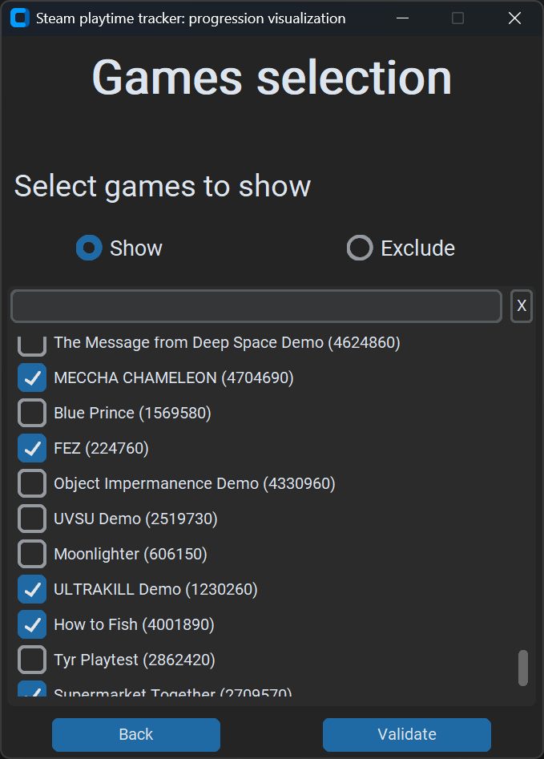
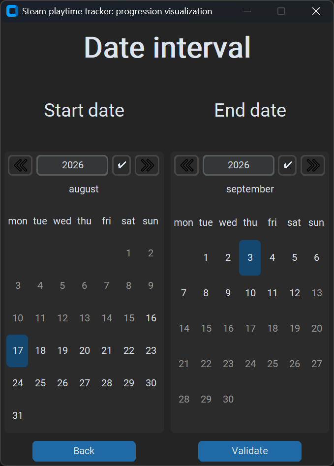
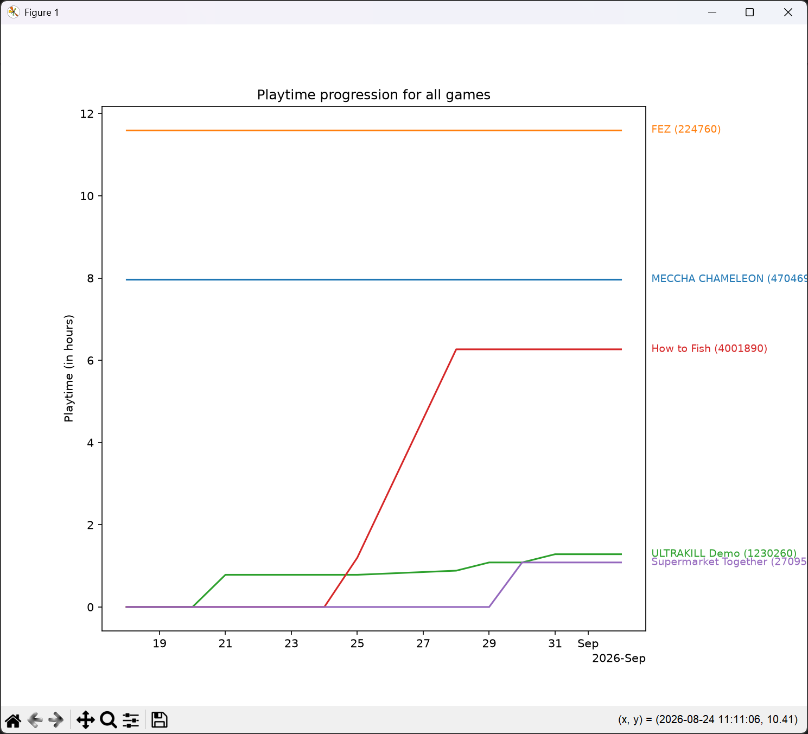

# Steam Playtime Tracker

Fastattack, 2026


## What is this repo

This repository contains python code that can read steam internal files to locally extract data that you would otherwise need to get from the steam API.

The file `read_steam_functions.py` contains all the functions to read data from the steam files.
It contains functions that can be directly used but is mainly created for an example of how to get the data from steam.

The file `games_data_codec.py` contains functions to write the extracted data to json or csv files.

The file `playtime_saver.py` contains a small program that uses the previous files to save your playtimes.

The file `playtime_visualization_CLI.py` contains functions that use matplotlib to visualize the saved playtimes.

The file `playtime_visualization_GUI.py` contains functions that create a GUI to select the data to visualize more easily. Following is an example of this GUI:






## Installation

If you want to use this program to save and visualize your playtimes, you can:

1. Download the `Source` folder from this repo to your machine.
2. Install python and then the `vdf` and `MoreCustomTkinterWidgets` module from pip.
3. Run the `playtime_saver.py` file from a cmd using the different CLI arguments.

If you want to run this script automatically every day to save your playtimes, you can:

1. Create a .bat file in the `Source` folder you downloaded
2. In this file write the command you would use to save yout playtimes i.e. 
```shell
python "[path where you downloaded the Source folder]/playtime_saver.py" daily
```

By putting `daily` in the command, the playtimes will be saved at most once a day. If you want to save the playtimes each time you run this command, put `save` instead.

Then, to run this command automatically at windows startup, you can create a shortcut to this file and put it in: `%APPDATA%\Microsoft\Windows\Start Menu\Programs\Startup`
